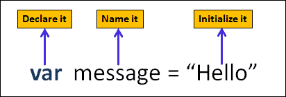
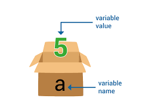

## LESSON-1

### 1. Input / Output 
### 2. Data types 
### 3. Variables

<hr>

- Input / Output 

```
// fix bugs 
"use strict";

// input

prompt("enter message...")


// output 
alert("message");
confirm("message...")

console.log("message");
console.warn("message");
console.info("message");

// operators

+ , - , / , * , % , ++ , --


// Variable names

var varName="value"; // camel cased +
var VarValue='value' // Pascal cased


```

### Data Types in JavaScript 
<hr>
1. Primative
<hr>

1. String
2. Number
3. Boolean
4. Null
5. Undefined
6. Symbol
7. BigInt

<hr>
2. Non Primative
<hr>

8. Object

- Object
- Array
- Functions 
- ETC ...

```
var person={
    name: "Jahongir",
    age:22,
    isActive: false
}

```

<hr>

## Variables in JavaScript 


- var       
- let   ES6
- const ES6



```

var a=5;

var message="Hello";
    message="World!";


```


```
{
    var app = "TestApp";
    app = "Telegram";
    app = "WhatsApp";
    var app = "Miro.app";
}

console.log(app);

{
    let lock = "JavaScript";
    lock = "PHP";
    // let lock = "C#";
    console.log(lock);
}

{
    const pi = 3.14;
    // pi = 5;
    // const pi=7
    console.log(pi);
}


```
