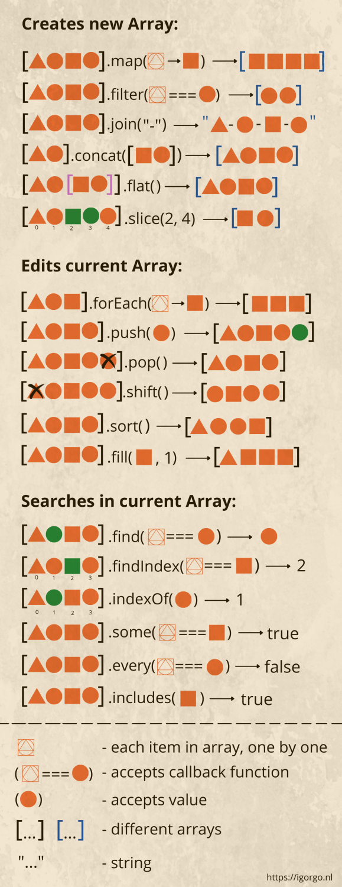

### lesson-10 ( FUNCTIONS  , ARRAY and methods , String and string methods )

- FUNCTIONS TYPES
- IIFE 
- ARRAY 
- ARRY methods
- STRING
- STRING methods


- #### FUNCTIONS 


- Immediately Invoked Function Execution (IIFE)

```
(function (parameters) {
   // statements
})(arguments);

```


- Function expression

```
let show = function() {
    console.log('Function expression');
};

show();

```


- Arrow Function

```

const add = (x, y) => { return x + y; };

const add = (x, y) => x + y;


```


## Array ( Massiv )  (https://javascript.info/array )

- ARRAY creation TYPES

- ARRAY literal  -> [ element1 , element2 , element3 , ........]

- Array methods 

- push +
- pop +
- unshift +
- shift +
- slice +
- splice +
- include +
- join + 
- reverse + 
- sort
- concat
- flat





